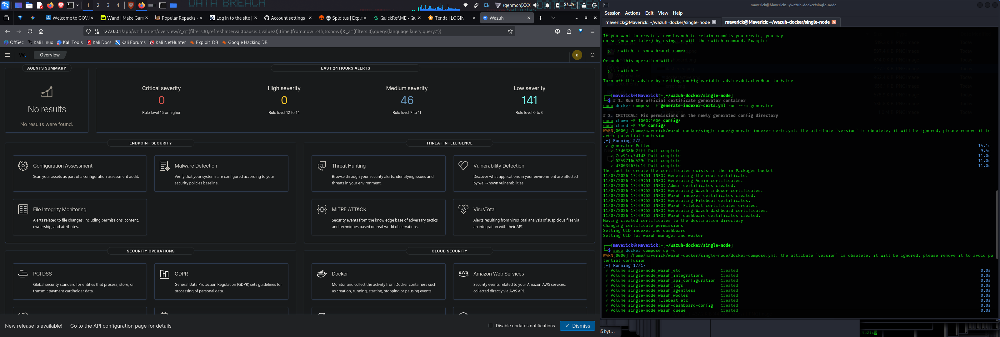
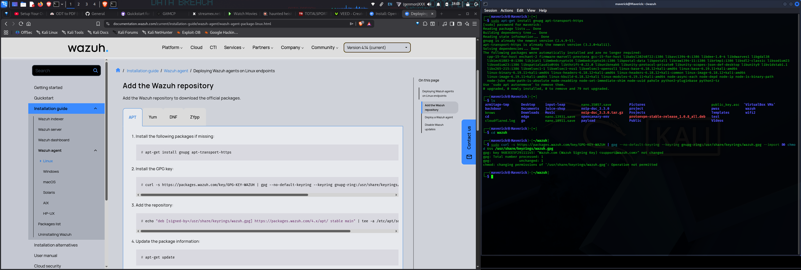
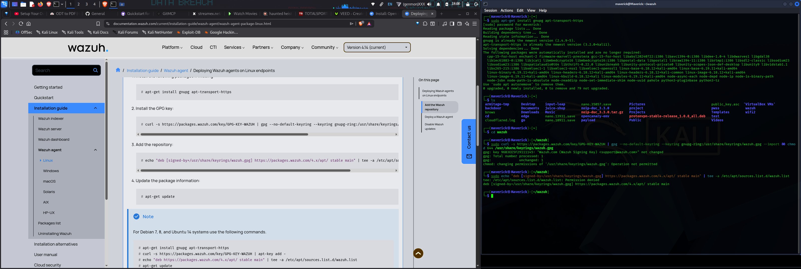
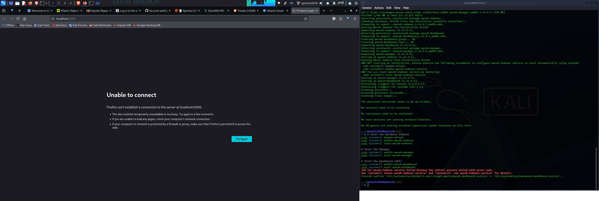
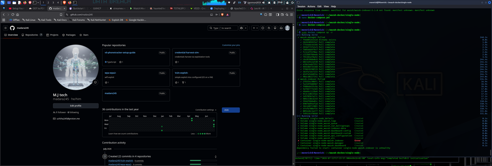
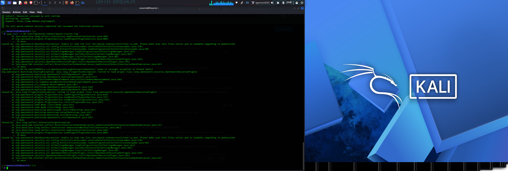
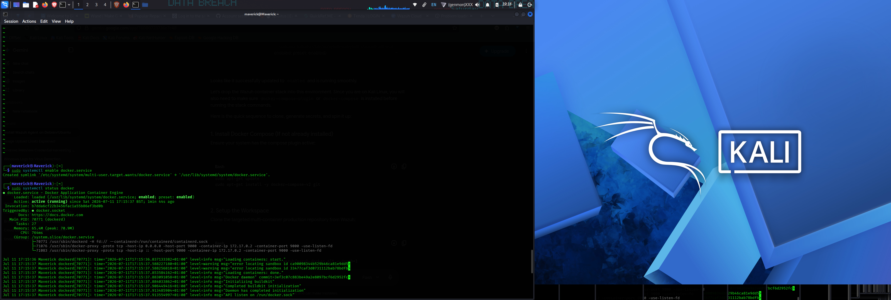
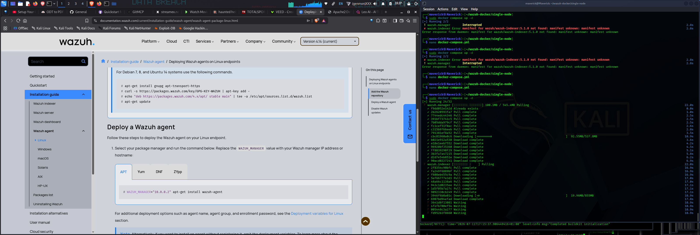
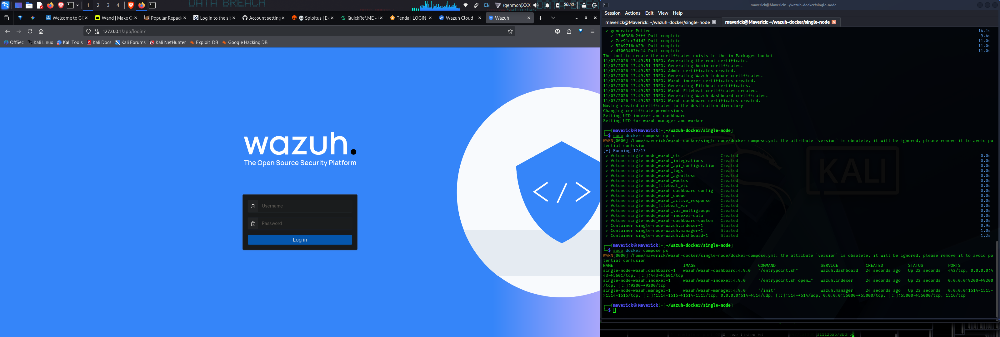
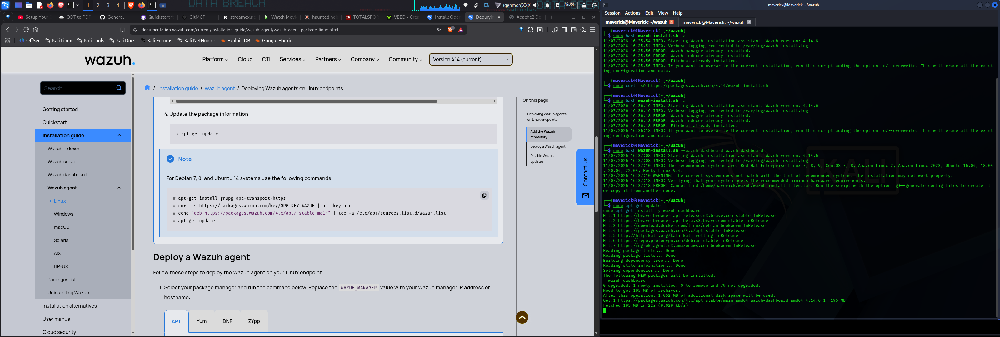

Here is your updated `README.md` block using the clean, new filenames. It maps them in order from the initial local installation attempts to the final operational Docker architecture, matching the `.png` extension inside your `Assets` folder exactly as requested.

```markdown
# Multi-Container Wazuh SIEM Deployment & Troubleshooting Guide

A comprehensive guide documenting the end-to-end deployment of a single-node Wazuh SIEM stack on Kali Linux via Docker Compose. This document walks through diagnosing system dependency issues, adjusting kernel constraints, correcting JVM security manager certificate permission locks, and achieving a successful deployment.

---

## 📊 Deployment Timeline & Diagnostic Index

The following sequential log tracks the development roadmap from initial installation failures to production health.

### Step 1: Initial Local Package Dependency Issues
* **Status:** Failed ❌
* **Context:** Attempted to install components locally alongside browser documentation, leading to socket connectivity blocks due to systemctl control layer failures.







```

[Connection Refused] Firefox cannot establish a connection to the server at localhost:5601.

```

---

### Step 2: Systemctl Service & Missing Certificate Verification
* **Status:** Failed ❌
* **Context:** Checking system engine initial states. The database indexer cluster logs exposed an immediate crash during the bootstrap phase because the security plugin could not read or locate the cryptographic assets.





```

java.lang.IllegalStateException: failed to load plugin class [org.opensearch.security.OpenSearchSecurityPlugin]
Caused by: org.opensearch.OpenSearchException: Unable to read the file /etc/wazuh-indexer/certs/root-ca.pem.

```

---

### Step 3: Transition to Container Platform & Kernel Constraints
* **Status:** Failed ❌
* **Context:** Migrated the architecture to Docker Compose to ensure isolation. The environment encountered a secondary bottleneck: the Linux kernel virtual memory allocation parameters (`vm.max_map_count`) were restricted below OpenSearch operational minimums, while active volume caches locked in bad certificate paths.





```

✘ Container single-node-wazuh.indexer    Error
dependency failed to start: container single-node-wazuh.indexer is unhealthy

```

---

### Step 4: Resolution & Verified Production Status
* **Status:** Operational / Healthy ✅
* **Context:** Executed a system cache volume purge (`down -v`), adjusted host kernel map counts, locked Git trees to release tags, and enforced strict `1000:1000` owner access configurations directly into the local persistent volume spaces.





```

[+] Running 4/4
✔ Container single-node-wazuh.indexer    Healthy
✔ Container single-node-wazuh.manager    Running
✔ Container single-node-wazuh.dashboard  Running

```

---

## 🛠️ Production Remediation Playbook

To reproduce the stable environment configurations achieved at the project completion phase, run the following command groups inside a clean workspace:

### 1. Tune Linux Kernel Engine
Increase the default virtual memory map capacities to prevent thread termination crashes:
```bash
sudo sysctl -w vm.max_map_count=262144
echo "vm.max_map_count=262144" | sudo tee -a /etc/sysctl.conf

```

### 2. Lock Repository Stable Release Tag

Avoid version mismatch drops across disparate component images by pinning the repository tag:

```bash
cd ~
git clone [https://github.com/wazuh/wazuh-docker.git](https://github.com/wazuh/wazuh-docker.git) -b v4.9.0
cd wazuh-docker/single-node

```

### 3. Generate Certs & Enforce Java Security Compliance

Execute the generation containers, then apply standard POSIX access controls matching the internal container engine UID (`1000`):

```bash
# Generate cluster internal keys
sudo docker compose -f generate-indexer-certs.yml run --rm generator

# Restrict permissions to satisfy internal Java Security Manager policies
sudo chown -R 1000:1000 config/
sudo chmod -R 750 config/

```

### 4. Deploy Isolated Stack Cleanly

```bash
# Clear any remaining volume cache footprints and launch
sudo docker compose down -v
sudo docker compose up -d

```

```

```
