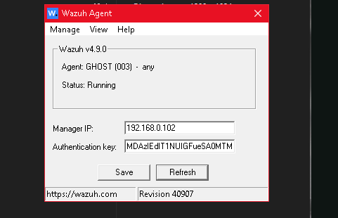
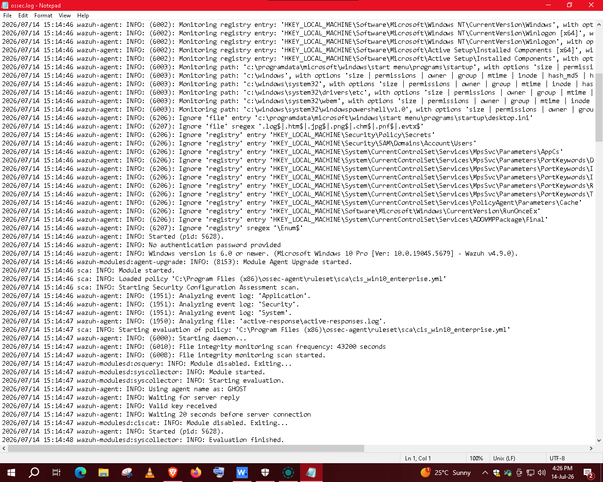
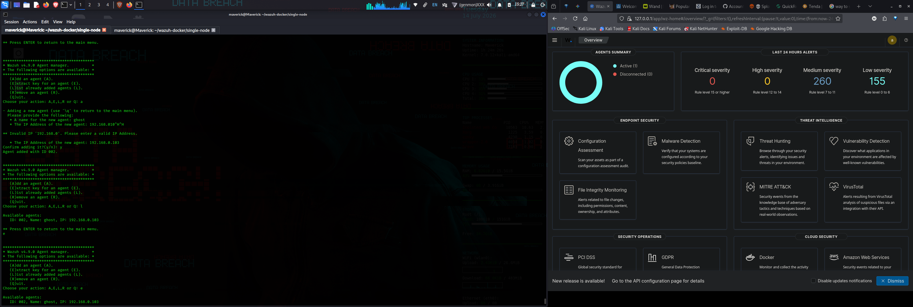
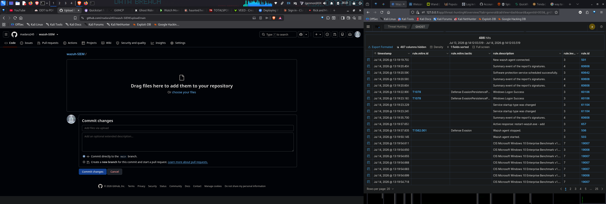
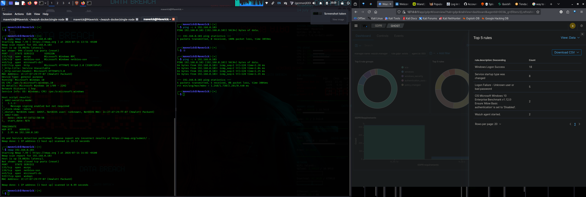
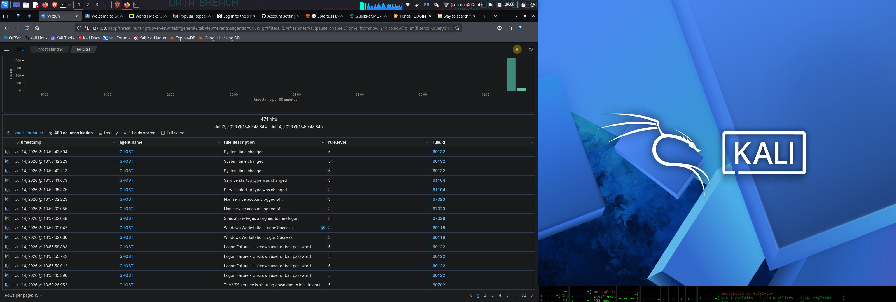

 # Host Monitoring, Threat Hunting, and Compliance Analytics via Wazuh SIEM

This module details the defensive implementation phase of the security environment, focusing on real-time endpoint monitoring, telemetry collection, and compliance auditing using the **Wazuh SIEM Enterprise Security Platform**. 

The tracked target asset is a Windows 10 Pro endpoint designated as **`GHOST`** (`192.168.0.103`), configured to ship system logs and security events directly to our centralized Wazuh Manager instance (`wazuh.manager`).

---

## 1. Agent Deployment & Connection State

To monitor the endpoint, the lightweight Wazuh agent service is installed on the Windows asset to securely funnel system level logs back to the central manager dashboard.

### Active Agent Inventory Overview
The administrative dashboard confirms successful agent enrollment and lists the runtime status and software metrics of the active target pool.

> **Description:** The Wazuh Manager agent UI tracking the active node overview. The agent ID `003` (named `GHOST`) shows an active "Active" status, reporting on version `v4.9.0` over the private network block `192.168.0.103`.

### Connection Handshake Analytics
Monitoring the raw endpoint registration log tracks the precise network timestamp when the remote system authenticated with the SIEM controller.

> **Description:** Filtered connection sequence logs tracking the handshake interval. The manager captures the registration, sync cycles, and persistence validation indicators necessary to establish uninterrupted telemetry parsing.

### Real-time Connectivity Telemetry
A dedicated dashboard view exposes continuous telemetry updates, confirming the host's keep-alive interval and registration profiles.

> **Description:** Graphical interface visualization mapping active connection status logs for Agent `003`. The live timeline validates that the endpoint is actively maintaining its keep-alive heartbeat with the central manager.

---

## 2. Threat Hunting & Security Events Telemetry

Once connected, the agent evaluates all incoming operating system anomalies, process spawns, and system modifications against signature-based rulesets.

### Security Alert Evolution Map
The management server groups log data dynamically to monitor high-priority alert volume trends over defined auditing intervals.

> **Description:** Threat Hunting dashboard displaying the alert groups evolution graph. High-density alert classifications include `sca` (Security Configuration Assessment), `windows`, `windows_security`, and `authentication_success`, correlating event patterns chronologically.

### Rule Evaluation Analytics
Incoming infrastructure logs are filtered by security impact levels and rule frequencies to isolate high-risk actions.

> **Description:** Data chart profiling the most frequently triggered rule configurations. Key alert patterns showcase Windows installer activity, database initialization routines, and system restoration processes.

### Event Severity Categorization
Visual metrics group incoming logs based on individual rule severity thresholds to assist analysts in prioritizing triage tasks.

> **Description:** Event analysis dashboard categorizing alerts by rule level distributions. The system filters standard noise from critical compliance alerts to accelerate response workflows.

---

## 3. Security Configuration Assessment (SCA) & Compliance Auditing

Wazuh maps system states against standard industry hardening frameworks (such as the CIS Benchmarks) to discover misconfigurations, running vulnerabilities, and policy deviations.

### CIS Benchmark Integrity Breakdown
The system reviews the current operating system state against hardening requirements, highlighting specific vulnerabilities and group policy deficiencies.

> **Description:** Security Configuration Assessment (SCA) dashboard auditing the host against the *CIS Microsoft Windows 10 Enterprise Benchmark*. The summary flags an overall compliance score below 50% due to unhardened default parameters, missing certificate authentication constraints, and relaxed patch reception guidelines.

---

## 4. Key Security Rules & Compliance Controls Map

The following baseline events were parsed and cross-referenced from the host telemetries to map current system behavior directly to industry requirements:

| Rule ID | Telemetry Description | Threat Classification | Framework Alignment |
| :--- | :--- | :--- | :--- |
| **501** | New Wazuh agent connected | Infrastructure Lifecycle | System Integrity |
| **60106**| Windows Logon Success | Authentication Audit | Access Control (CC6.1) |
| **60610**| Windows installer began an installation process | Privilege Operations | Change Management |
| **61104**| Service startup type was changed | System Alteration | Anomaly Detection (CC7.2) |
| **19009**| Missing Certificate-Based Device Auth | Hardening Deficiency | CIS Benchmark Sec 1.12 |

---

## 5. Architectural Implementation Summary
By utilizing centralized log parsing alongside native signature matching, this defensive design ensures:
1. **Continuous Telemetry Visibility:** Instant tracking of host lifecycle states (`guiagent.png`, `cntlog.png`).
2. **Proactive Misconfiguration Management:** Standardized CIS auditing routines (`csi.png`) to identify attack surfaces before exposure.
3. **Streamlined Threat Prioritization:** Clear analytical classification (`events.png`, `5rules.png`) to filter typical environment background noise from critical infrastructure events.
